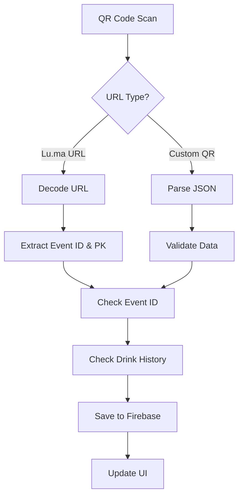

# Lu.ma Redemption System

A comprehensive QR code scanning system for drink and meal redemptions at events, with direct integration for Lu.ma check-in URLs and secure server-side API handling.

## 🚀 Quick Start

### 1. Environment Setup

Create your environment file based on the example:

```bash
cp .env.example .env
```

Edit `.env` with your configuration:

```env
# Firebase Configuration
NEXT_PUBLIC_FIREBASE_API_KEY=your_firebase_api_key
NEXT_PUBLIC_FIREBASE_AUTH_DOMAIN=your_project.firebaseapp.com
NEXT_PUBLIC_FIREBASE_PROJECT_ID=your_project_id
NEXT_PUBLIC_FIREBASE_STORAGE_BUCKET=your_project.appspot.com
NEXT_PUBLIC_FIREBASE_MESSAGING_SENDER_ID=your_sender_id
NEXT_PUBLIC_FIREBASE_APP_ID=your_app_id
NEXT_PUBLIC_FIREBASE_MEASUREMENT_ID=G-XXXXXXXXXX

# Event Configuration
NEXT_PUBLIC_EVENT_ID=evt-pEL2QyThOoezJWn  # Optional - leave empty for dynamic events

# Lu.ma API Configuration
NEXT_PUBLIC_LUMAAPIKEY=your_luma_api_key_here  # Required for Lu.ma integration

# Redemption Limits
NEXT_PUBLIC_MAX_DRINKS_PER_GUEST=3  # Default: 3 drinks per guest
NEXT_PUBLIC_MAX_MEALS_PER_GUEST=1   # Default: 1 meal per guest
```

### 2. Debugging and Logging

The system includes comprehensive logging for debugging:

- **API Response Logging**: Console logs show detailed Lu.ma API response data
- **Event Validation**: Logs when event ID validation occurs
- **Guest Data**: Shows guest email, name, and approval status
- **Error Handling**: Clear error messages for API failures

**To view logs:**

- **Development**: Check your terminal where you run `npm run dev`
- **Production**: Check your hosting platform's logs (Vercel, Netlify, etc.)

### 2. Install Dependencies

```bash
npm install
# or
pnpm install
```

### 3. Run Development Server

```bash
npm run dev
# or
pnpm dev
```

Open [http://localhost:3000](http://localhost:3000) to view the application.

## 🔒 Security & Configuration

### Lu.ma API Integration

The system integrates directly with Lu.ma's API for real-time guest verification:

#### **API Key Setup:**

1. Get your Lu.ma API key from your Lu.ma dashboard
2. Add it to your `.env` file as `NEXT_PUBLIC_LUMAAPIKEY`
3. The system will automatically verify guests against your Lu.ma event

#### **API Endpoint:**

The system uses the Lu.ma API endpoint: `https://public-api.luma.com/v1/event/get-guest`

#### **Event ID Security:**

The system can operate in two modes for event ID validation:

**Secure Mode (Recommended):**
Set `NEXT_PUBLIC_EVENT_ID` in your `.env` file to validate Lu.ma URLs against a specific event. This prevents unauthorized access from other events.

**Dynamic Mode (Flexible):**
Leave `NEXT_PUBLIC_EVENT_ID` empty to accept any Lu.ma event URL. The system will use the event ID from the scanned URL.

#### **Redemption Limits:**

Configure drink and meal limits per guest:

- `NEXT_PUBLIC_MAX_DRINKS_PER_GUEST=3` (default: 3 drinks)
- `NEXT_PUBLIC_MAX_MEALS_PER_GUEST=1` (default: 1 meal)

**To change the event ID:**

1. **Update .env file:**

   ```env
   NEXT_PUBLIC_EVENT_ID=evt-your-new-event-id  # For secure mode
   # NEXT_PUBLIC_EVENT_ID=  # Leave empty for dynamic mode
   ```

2. **Update Firebase Security Rules** (see Firebase Security section below)

3. **Update Luma Data** (if using local luma.json):
   ```json
   {
     "entries": [
       {
         "api_id": "evt-your-new-event-id",
         "guest": {
           "email": "guest@example.com",
           "name": "Guest Name",
           "approval_status": "approved"
         }
       }
     ]
   }
   ```

### Firebase Security Rules

Configure your Firestore security rules to restrict access:

```javascript
rules_version = '2';
service cloud.firestore {
  match /databases/{database}/documents {
    // Drinks scans collection
    match /drinksScans/{document} {
      allow read, write: if request.auth != null &&
        (request.auth.token.email_verified == true ||
         request.auth.token.role == 'admin');
    }

    // Event participants collection
    match /ethpartyparticipants/{document} {
      allow read: if request.auth != null;
      allow write: if request.auth != null &&
        request.auth.token.role == 'admin';
    }

    // VivaCity users collection
    match /ethpartyparticipants/{document} {
      allow read, write: if request.auth != null;
    }
  }
}
```

## 🏗️ System Architecture

### Data Flow



### Firebase Collections

#### 1. `drinksScans` Collection

Stores all drink redemption records:

```typescript
interface ScanRecord {
  id: string;
  email: string;
  attendeeName: string;
  scannedAt: string;
  lumaVerified: boolean;
  drinksRedeemed: boolean;
  scanCount: number;
  remainingDrinks: number;
  qrData: {
    email: string;
    attendeeId: string;
    drinksAllowed: number;
    generatedAt: string;
    lumaUrl?: string;
    eventId?: string;
    publicKey?: string;
  };
}
```

#### 2. `ethpartyparticipants` Collection

Stores event participant data:

```typescript
interface Participant {
  id: string;
  email: string;
  fullName: string;
  role: string;
  drinksAllowed: number;
  validFrom: string;
  validTo: string;
}
```

#### 3. `ethpartyparticipants` Collection

Stores user data for special features:

```typescript
interface VivaCityUser {
  id: string;
  email: string;
  fullName: string;
  role: string;
  createdAt: string;
}
```

## 🔗 Lu.ma Integration

### How Lu.ma URLs Work

The system processes Lu.ma check-in URLs in the format:

```
https://lu.ma/check-in/evt-pEL2QyThOoezJWn?pk=g-m8Y112wpmIWvmpW
```

**URL Components:**

- `evt-pEL2QyThOoezJWn`: Event ID (validated against .env)
- `g-m8Y112wpmIWvmpW`: Public key for check-in access

### URL Processing Steps

1. **Detection**: System identifies Lu.ma URLs by checking for `https://lu.ma/check-in/`

2. **Decoding**: URL-encoded characters are decoded:

   ```javascript
   const decodedUrl = decodeURIComponent(scannedText);
   // %3F becomes ?, %2F becomes /, etc.
   ```

3. **Extraction**: Event ID and public key are extracted:

   ```javascript
   const urlMatch = decodedUrl.match(
     /https:\/\/lu\.ma\/check-in\/([^?]+)\?pk=([^&]+)/
   );
   const [, eventId, publicKey] = urlMatch;
   ```

4. **Validation**: Event ID is checked against `NEXT_PUBLIC_EVENT_ID`

5. **Processing**: Creates drink redemption record with:
   - Email: `luma-{eventId}@checkin.com`
   - Drinks Allocated: 3 (configurable)
   - Luma Verified: true

### Security Considerations

- **Event ID Validation**: Only accepts URLs for the configured event
- **URL Encoding**: Handles both encoded and non-encoded URLs
- **Public Key Storage**: Public keys are stored for audit purposes
- **Rate Limiting**: 3 drinks per event ID (configurable)

## 📊 Database Schema

### Drink Redemption Record Example

```json
{
  "id": "auto-generated",
  "email": "luma-evt-pEL2QyThOoezJWn@checkin.com",
  "attendeeName": "Lu.ma Guest (evt-pEL2QyThOoezJWn)",
  "scannedAt": "2024-01-15T10:30:00.000Z",
  "lumaVerified": true,
  "drinksRedeemed": true,
  "scanCount": 1,
  "remainingDrinks": 2,
  "qrData": {
    "email": "luma-evt-pEL2QyThOoezJWn@checkin.com",
    "attendeeId": "evt-pEL2QyThOoezJWn",
    "drinksAllowed": 3,
    "generatedAt": "2024-01-15T10:30:00.000Z",
    "lumaUrl": "https://lu.ma/check-in/evt-pEL2QyThOoezJWn?pk=g-m8Y112wpmIWvmpW",
    "eventId": "evt-pEL2QyThOoezJWn",
    "publicKey": "g-m8Y112wpmIWvmpW"
  }
}
```

## 🛠️ Configuration Options

### Environment Variables

| Variable               | Description                   | Default | Required |
| ---------------------- | ----------------------------- | ------- | -------- |
| `NEXT_PUBLIC_EVENT_ID` | Lu.ma event ID for validation | -       | No       |

### Firebase Configuration

Ensure your Firebase project has:

- **Firestore Database** enabled
- **Authentication** configured (optional but recommended)
- **Security Rules** properly set
- **Collections** created: `drinksScans`, `ethpartyparticipants`, `ethpartyparticipants`

## 🔧 Development

### Project Structure

```
PopUpTSOps/
├── app/                    # Next.js app directory
│   ├── api/               # API routes
│   ├── pos/               # POS scanning page
│   ├── redeem/            # QR redemption page
│   └── page.tsx           # Main landing page
├── components/            # React components
│   ├── qr-scanner.tsx     # QR code scanner
│   ├── qr-redemption.tsx  # QR code generation
│   └── ui/               # UI components
├── lib/                  # Utility libraries
│   ├── firebase.ts       # Firebase configuration
│   ├── luma-utils.ts     # Luma data utilities
│   └── utils.ts          # General utilities
├── public/               # Static assets
│   ├── luma.json         # Local Luma data (optional)
│   └── beep.mp3          # Success sound
└── types/                # TypeScript type definitions
```

### Key Features

- **QR Code Scanning**: Camera-based QR code scanning
- **Lu.ma Integration**: Direct processing of Lu.ma check-in URLs
- **Drink Tracking**: 3-drink limit per guest with Firebase storage
- **Real-time Statistics**: Live drink redemption statistics
- **Audit Trail**: Complete history of all redemptions
- **Security**: Event ID validation and Firebase security rules

## 🚨 Troubleshooting

### Common Issues

1. **"Invalid Lu.ma URL" Error**

   - Check that the event ID in `.env` matches the URL
   - Ensure URL encoding is handled (system does this automatically)

2. **Firebase Connection Issues**

   - Verify Firebase configuration in `.env`
   - Check Firebase security rules
   - Ensure collections exist in Firestore

3. **Camera Access Denied**

   - Check browser permissions
   - Ensure HTTPS is used (required for camera access)

4. **QR Code Not Scanning**
   - Verify QR code format is valid JSON
   - Check that all required fields are present
   - Ensure QR code is not damaged or poorly printed

## 📝 License

This project is licensed under the MIT License - see the LICENSE file for details.

## 🤝 Contributing

1. Fork the repository
2. Create a feature branch
3. Make your changes
4. Add tests if applicable
5. Submit a pull request

## 📞 Support

For support and questions:

- Create an issue in the repository
- Check the troubleshooting section
- Review Firebase documentation for configuration issues
